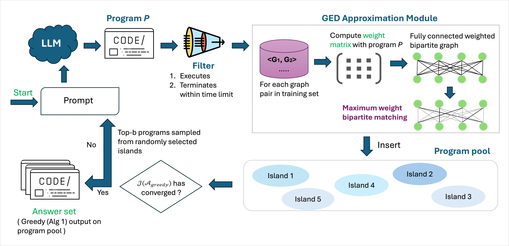

# GRAIL: Graph Edit Distance and Node Alignment using LLM-Generated Code

## Overview

*Graph Edit Distance* (GED) is an essential but NP-hard similarity metric, leading to the development of various heuristic and neural approximations. However, neural methods face key challenges: (1) they require large amounts of NP-hard-to-compute ground truth data, (2) function as black boxes with limited interpretability, and (3) lack cross-domain generalization, requiring costly retraining. **GRAIL** overcomes these limitations by using large language models (LLMs) and automated prompt tuning to generate *programs* for GED computation instead of direct GED prediction. This shift enhances interpretability, enables self-evolutionary learning without ground-truth supervision, enables generalizability, and achieves superior approximation quality.

## Pipeline Figure



## Datasets

GRAIL has been evaluated on multiple datasets:

* Unlabelled Nodes

1. Linux
2. IMDB
3. ogbg-ppa (Extremely large graphs, inference only)

* Labelled Nodes

1. AIDS
2. ogbg-molhiv
3. ogbg-molpcba
4. ogbg-code2

Datasets are stored in the `data/` directory in sub-directories `data/train`, `data/val` and `data/test`.

## Setup

1. Download the repository

```bash
  cd GRAIL
  conda env create -f env.yml
  conda activate grail
  cd src
```

2. Unzip data.zip to extract data/ directory
```bash
  unzip data.zip
```

3. Setup a Google Cloud Account, and get key to use Gemini. Place the key in `sampler.py` line 36.

## Directory Structure

```bash
GRAIL/
├── data/
│   ├── test/
│   ├── train/
│   └── val/
├── src/
│   ├── discovered_programs/
│   ├── top_15/
│   ├── top_fns_transfer/
│   ├── val_transfer/
│   ├── calc_wo_gt.py
│   ├── code_manipulation.py
│   ├── config.py
│   ├── evaluator.py
│   ├── extract_func_names.py
│   ├── extract_unique_functions.py
│   ├── funsearch.py
│   ├── graph.txt
│   ├── logger.py
│   ├── parallel_test.py
│   ├── parallel_val.py
│   ├── postprocess.py
│   ├── programs_database.py
│   ├── sampler.py
│   ├── temp.py
│   └── transfer.sh
├── .gitignore
├── env.yml
├── grail_pipeline.jpg
└── README.md
```

<!-- ### Example: Computing Graph Edit Distance

```python
from grail.ged import compute_ged

G1 = load_graph("graph1.json")
G2 = load_graph("graph2.json")
ged = compute_ged(G1, G2)
print(f"Graph Edit Distance: {ged}")
```

### Example: Node Alignment

```python
from grail.alignment import align_nodes

alignment = align_nodes(G1, G2)
print("Node Alignment:", alignment) 
-- ``` -->

## Evolution

To discover priority functions for GED computation using GRAIL, follow these steps:

```bash
python funsearch.py --dataset <dataset_name>
```

Replace `<dataset_name>` with one of the supported datasets:

- `linux`
- `imdb`
- `aids`
- `ogbg-molhiv`
- `ogbg-molpcba`
- `ogbg-code2`
- `mixture`

For example, to run GRAIL on the `imdb` dataset, use:

```bash
python funsearch.py --dataset imdb
```

### Notes

- Ensure that the dataset name is correctly specified.
- The script will execute the function discovery process based on the selected dataset.

## Inference

**To evaluate the performance of GRAIL or GRAIL-Mix with currently discovered functions:**

```bash
chmod +x inference.sh 
./inference.sh <test_dataset_name> <function_dataset_name>
```

For example:

- To infer on the `imdb` test dataset, using functions evolved using `imdb` train dataset, use:

```bash
  ./inference.sh imdb imdb
```

- To infer on the `imdb` test dataset, using functions evolved using `aids` train dataset, use:

```bash
  ./inference.sh imdb aids
```

- To infer on the `imdb` test dataset, using functions evolved using `mixture` train dataset, use:

```bash
  ./inference.sh imdb mixture
```

**To evaluate the performance of GRAIL with new discovered functions:**

1. Extract unique functions from logs, you can pick top-k, random-k, or bottom-k. Change in extract_unique_functions.py.

```bash
    python extract_unique_functions.py --log_path <path_to_function_log> --dataset <dataset_name>
```

*Note:* Right now we pick top-65. We only pick stand-alone functions and discard the modular ones, since renaming functions and maintaining correspondance while also keeping unique functions posed challenges in maintaining correctness that may be dealt with in future versions of this code.

2. Compute predictions on validation set, then extract out top-15 based on average GED upper bound reduction. *No ground truth is used.* For non-transfer experiments val_dataset_name, function_dataset_name and test_dataset_name are the same.

```bash
  python parallel_val.py --valset <val_dataset_name> --func_set <function_dataset_name>
  python calc_wo_gt.py --valset <val_dataset_name> --func_set <function_dataset_name>
```

3. Evaluate the top-15 functions on test-set

```bash
  python parallel_test.py --testset <test_dataset_name> --func_set <function_dataset_name>
```

4. **To directly use top-15 functions selected greedily based on marginal gains in terms of average upper bound reduction on train set**, we need to pick functions from the best epoch, llm calls combination saved in `best_epoch_llm_calls_{dataset}{store_suffix}` from the `./best_functions/{dataset}/after_submod/` folder. These would then all be renamed uniquely and saved in a python file. Some functions would be modular and calling other functions internally, the correspondance has to be maintained when renaming. This was done manually for now. We will write a script to automate this in the future.

- Save functions according to above instructions in `discovered_programs` folder with name as `submod_<dataset_name>.py`
- Extract unique function names from discovered_programs/submod_<dataset_name>.py

  ```bash
  python extract_func_names.py --dataset <dataset_name>
  ```
- Inference

  ```bash
  python inference.py --testset <test_dataset_name> --func_set  <function_dataset_name>
  ```

## Transferability Experiment

```bash
bash transfer.sh
```

## Other details

1. Best programs based on marginal gain in terms of reduction of average upper bound GED of train examples are given in discovered_programs folder. These programs are dataset specific i.e. GRAIL (submod_<dataset_name>.py>) and dataset agnostic(mixture training) i.e. GRAIL-Mix (submod_mixture.py>).
2. GRAIL-Mix functions are directly used to compute and evaluate GED on test set.
3. Transferability Experiment: We pick 65 unique functions from the logs of dataset-specific training/evolution. Further, based on average upper bound GED reduction on a validation set, we greedyily select top-15 out of those. These are used for evaluation of test set. It can be thought of as fine-tuning stage in a general deep learning pipeline. Fine-tuning is only done for differing train and test sets.
4. For ogbg-ppa we directly conduct evaluation using best 15 functions found during mixture training, i.e. GRAIL-Mix

**Note:** No ground truth is used for validation set as well. Since predicted GED is an upper bound on the true GED, we only measure reduction in the average upper bound GED across validation examples.

## Acknowledgments

GRAIL's pipeline has been built on top of Romera-Paredes et al. (2024)`<sup>`[1]`</sup>`. We appreciate the contributions from the research community.

## References

[1] Romera-Paredes, Bernardino, Mohammadamin Barekatain, Alexander Novikov, Matej Balog, M. Pawan Kumar, Emilien Dupont, Francisco JR Ruiz et al. "Mathematical discoveries from program search with large language models." Nature 625, no. 7995 (2024): 468-475.
